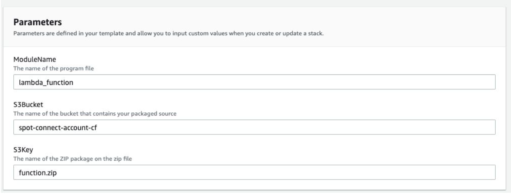
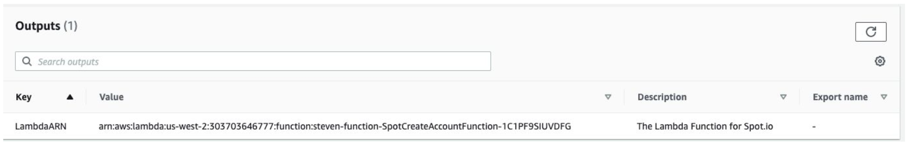
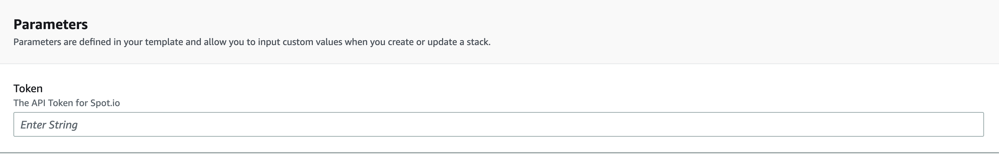

# Overview

Quickly connect all AWS accounts within an AWS organization or OU to spot.io. The process will create
a policy and role in each AWS account. The role ARN from each AWS account will then be supplied to
the spot platform to connect and consume. The solution will leverage cloud formation stacksets to run a
cloudformation stack in each AWS account. The accounts in Spot will be named using the AWS

# Pre-req:

#### Step 1.
User with access to the Master Payer account. User will need at ​ **least** ​ the following permission:
<ol>

	    A. Create a lambda function
	    B. Create/run CF templates.
	    C. Create IAM Policy/Role
</ol>


<ol>

	    D. Read-only permissions to AWS organization.
</ol>


<ol>

	    E. Read/write permissions to SSM Parameter Store.
</ol>

#### Step 2.
Enable Trusted Access with AWS Organizations - ​[Doc](https://docs.aws.amazon.com/AWSCloudFormation/latest/UserGuide/stacksets-orgs-enable-trusted-access.html)
#### Step 3.
ExternalID string sequence for Spot account role - The regex used to validate this parameter is a string of characters consisting of upper and lower-case alphanumeric characters with no spaces. You can also include underscores or any of the following characters: =,.@:/- ​[Doc](https://aws.amazon.com/blogs/security/how-to-use-external-id-when-granting-access-to-your-aws-resources/)
#### Step 4.
Spot API token with admin access to Spot Organization - ​[Doc](https://help.spot.io/spotinst-api/administration/create-an-api-token)
#### Step 5.
Check the Spot ORG allows adding additional accounts (Contact Spot to enable)

# Step 1: Create a Lambda Function:

#### Step 1.
Create a Lambda function to pass Role ARN to Spot. ​ **_(NOTE: All items need to run in us-east-1 (Virginia). If desired to run in a different region, the lambda code will need to be downloaded and uploaded to a bucket and region of your choice.)_**


A. Navigate to Cloudformation Service in Master Payer Account.<br>
B. Run the following template: “spot_create_account_function.cf”<br>
    i. Template URL: [https://spot-connect-account-cf.s3.amazonaws.com/spot_create_account_function.cf](https://spot-connect-account-cf.s3.amazonaws.com/spot_create_account_function.cf)<br>
C. The template will default with these parameters. (Only change if using different region)<br>
D. The template will output the ARN of the newly created Lambda function:<br>
E. Copy and save the output for the next step<br>

#### Step 2:
Create Stackset - AWS Console (UI):
#### Run StackSet:
   
        A. Navigate to Cloudformation Service in Master Payer Account
        B. Select “StackSets” -> Create Stackset
        C. Upload/provide the link for the following template: ​ **_spot-create-account.cf_**
                i. Template URL for Full Permissions: <a href="https:/spot-connect-account-cf.s3.amazonaws.com/spot-create-account.cf">https:/spot-connect-account-cf.s3.amazonaws.com/spot-create-account.cf</a>
                ii. Template URL for Read-Only Permissions: [https://spot-connect-account-cf.s3.amazonaws.com/spot-create-account-read-onl
        y.cf](https://spot-connect-account-cf.s3.amazonaws.com/spot-create-account-read-onl%20y.cf)
        D. Enter the following Parameters:
                i. LambdaARN from the previous Cloudformation
                ii. External ID random string of your choice
                iii. API Token for Spot.io
                iv. Omit/Skip AccountName when running as a StackSet (Only use when connecting a single account using a single stack - DO NOT USE WITH STACKSET)

        E. Step 3 - Configure StackSet options (Apply defaults)
                i. Service Managed Permissions ​ - Allows for automatic deployment to    all accounts
                ii. Self-service permissions - Allows deploying to specific accounts
                iii. IAM execution role name - “AWSCloudFormationStackSetExecutionRole”
        F. Step 4 - Set deployment options:
                i. Decide which accounts to deploy to:
                    ● Select ​ “Deploy to Organization” ​ (Organization Root ID eg. r-1234) OR
                    ● Select ​ “Deploy to organizational units (OUs)” and enter OU IDs (OU ID eg. ou-12w3-pk1cphl0) OR
                    ● Specific account numbers (Only if using Self-service permissions)
                ii. Specify Region to deploy
                    ● Select the same region the Lambda function is deployed. (us-east-1)
        G. Review and Run
            i. On the Review page of the Create Stack wizards, choose ​ “I acknowledge this template may create IAM resources” ​.


# Step 2: Create Stackset - API (AWS CLI)

#### Step 1. 
Download parameter.json - ​https://spot-connect-account-cf.s3.amazonaws.com/parameters.json
<ol>

            a. Edit and Enter the following:
                i. StackSetName
                ii. LambdaARN
                iii. Token
                iv. ExternalID
                v. PermissionModel (SERVICE_MANAGED OR SELF_SERVICE)
                    1. Service_manage -> Deploys to entire ORG or specific OU
                    2. Self_Services -> Deploys to specific accounts
            b. Save
</ol>

#### Step 2. Create the stackset:

            ```
            a. aws cloudformation create-stack-set --cli-input-json
            file://parameters.json
            ```
            
#### Step 3. Create stack instances (Enter stack-name and Org ID):
            a. Stack-name from above
            b. Retrieve Root Org-ID: (Required to be called from the organization’s master account or
            by a member that is a delegated administrator access for Organizations eg: r-1234 ):
                aws organizations list-roots | jq '.Roots' | jq '.[].Id'
            c. Create stack-instances (SERVICE_MANAGED):
            aws cloudformation create-stack-instances --stack-set-name
            <Stack Name> --deployment-targets
            OrganizationalUnitIds=<r-1234> --regions us-east-

            d. Create stack-instances (SELF_SERVICE):
            aws cloudformation create-stack-instances --stack-set-name
            <Stack Name> --deployment-targets Accounts=<123456789,
            555123455> --regions us-east-


# Troubleshooting

● Logs are placed in the same account as the Lambda function.
○ Cloudwatch -> LogGroups -> Name of stack.
● There are print messages showing when a call was received and each api status. Review for
any errors and troubleshooting.

# Removing Stackset

#### Step 1. Delete Stacks from StackSet
    ○ Actions -> ​ **_“Delete Stacks from StackSet”_**

○ Provide OU ID (Root: r-1234 or OU: ou-123-abc123)
○ Select all regions
○ Submit/Run

#### Step 2. Once Operation completes Delete StackSet
    ○ Actions -> ​ **_“Delete Stackset”_**
