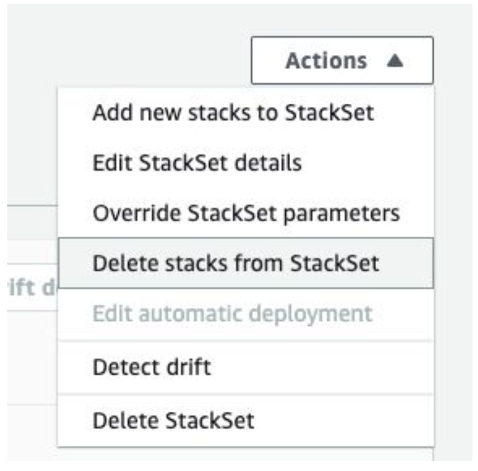

<p align="center"></p>

# Overview

Quickly connect all AWS accounts within an AWS organization or OU to spot.io. The process will create
a policy and role in each AWS account. The role ARN from each AWS account will then be supplied to
the spot platform to connect and consume. The solution will leverage cloudformation stacksets to run a
cloudformation stack in each AWS account. The accounts in Spot will be named using the AWS accounts billing name.

## Pre-req:

1. User with access to the Master Payer account. User will need at **least** the following permission:  
    A. Create a lambda function.   
    B. Create/run CF templates.  
    C. Create IAM Policy/Role.  
    D. Read-only permissions to AWS organization.  
    E. Read/write permissions to SSM Parameter Store.
2. Enable Trusted Access with AWS Organizations. - [Doc](https://docs.aws.amazon.com/AWSCloudFormation/latest/UserGuide/stacksets-orgs-enable-trusted-access.html)
3. Spot API token with admin access to Spot Organization. [Doc](https://help.spot.io/spotinst-api/administration/create-an-api-token)
4. Check the Spot ORG allows adding additional accounts (Contact Spot to enable).

## Step 1: Create Lambda Function:

(NOTE: All items need to run in us-east-1 (Virginia). If desired to run in a different region, the lambda code will need to be downloaded and uploaded to a bucket and region of your choice.)  

A. Navigate to Cloudformation Service in Master Payer Account.  
B. Select "Create Stack" ->  "With New Resource (standard)" -> Copy and enter the URL for the template source (S3):  
```
    https://spot-connect-account-cf.s3.amazonaws.com/spot_create_account_function.yaml
```
C. The template will default values. Enter the AWS Organization ID (Only change default values if using a different region)  
<ol><div></div></ol>
D. The template will output the ARN of the newly created Lambda function:  
<ol><div></div></ol>
E. Copy and save the output for the next step  


## Step 2: (Option 1) - Create Stackset - AWS Console (UI):
A. Navigate to Cloudformation Service in Master Payer Account  
B. Select “StackSets” -> Create Stackset  
C. Configure StackSet Permissions:  
&nbsp;&nbsp;&nbsp;&nbsp;i. (Default) Service Managed Permissions - Allows for automatic deployment using an AWS autogenerated IAM role to Organizational Units or entire organization    
&nbsp;&nbsp;&nbsp;&nbsp;ii. Self-service permissions - Allows for automatic deployment using a self managed IAM role to specific AWS account IDS.  
D. Copy and enter the URL for the template source (S3):  
- Template URL for full permissions:
```
    https://spot-connect-account-cf.s3.amazonaws.com/spot-create-account.yaml
```
- Template URL for Read-Only permissions:  
```
    https://spot-connect-account-cf.s3.amazonaws.com/spot-create-account-read-only.yaml
```

E. Specify Stackset details:  
&nbsp;&nbsp;&nbsp;&nbsp;i. LambdaARN from the previous Cloudformation  
&nbsp;&nbsp;&nbsp;&nbsp;ii. API Token for Spot.io (Must be a personal Org Admin token)    

<div></div>

F. Configure StackSet options:  
&nbsp;&nbsp;&nbsp;&nbsp;i. (Optional) Add desired tags
&nbsp;&nbsp;&nbsp;&nbsp;ii. (Default) Execution configuration set to "Inactive"

G. Set deployment options:  
&nbsp;&nbsp;&nbsp;&nbsp;i. Options for "Service Managed Permissions"  
&nbsp;&nbsp;&nbsp;&nbsp;&nbsp;&nbsp;&nbsp;&nbsp; A. Select "Deploy to Organization" (Organization Root ID eg. r-1234) OR  
&nbsp;&nbsp;&nbsp;&nbsp;&nbsp;&nbsp;&nbsp;&nbsp; B. Select "Deploy to organizational units (OUs)" and enter OU IDs (OU ID eg. ou-12w3-pk1cphl0) OR  
&nbsp;&nbsp;&nbsp;&nbsp;ii. Options for "Self-service permissions"  
&nbsp;&nbsp;&nbsp;&nbsp;&nbsp;&nbsp;&nbsp;&nbsp; A. Enter specific account number/s seperated by a comma.  
&nbsp;&nbsp;&nbsp;&nbsp;iii. Specify Region to deploy:  
&nbsp;&nbsp;&nbsp;&nbsp;&nbsp;&nbsp;&nbsp;&nbsp; A. Select the same region the Lambda function is deployed (us-east-1).  

H. Review and Run  
&nbsp;&nbsp;&nbsp;&nbsp;i. On the Review page of the Create Stack wizard, choose "I acknowledge this template may create IAM resources" -> Submit


## Step 2: (Option 2) - Create Stackset - API (AWS CLI)

A. Download `parameter.json` from: <a href="https://spot-connect-account-cf.s3.amazonaws.com/parameters.json">https://spot-connect-account-cf.s3.amazonaws.com/parameters.json  
B. Edit and enter the following:  
&nbsp;&nbsp;&nbsp;&nbsp;i. StackSetName  
&nbsp;&nbsp;&nbsp;&nbsp;ii. LambdaARN  
&nbsp;&nbsp;&nbsp;&nbsp;iii. Token  
&nbsp;&nbsp;&nbsp;&nbsp;iv. PermissionModel (SERVICE_MANAGED OR SELF_SERVICE)  
&nbsp;&nbsp;&nbsp;&nbsp;&nbsp;&nbsp;&nbsp;&nbsp; A. Service_manage -> Deploys to entire ORG or specific OU  
&nbsp;&nbsp;&nbsp;&nbsp;&nbsp;&nbsp;&nbsp;&nbsp; B. Self_Services -> Deploys to specific accounts  
C. Save  
D. Call AWS CLI to create stackset:
```
    aws cloudformation create-stack-set --cli-input-json file://parameters.json
```

E. Create Stack Instances  
&nbsp;&nbsp;&nbsp;&nbsp;i. Retrieve Root Org-ID: (Required to be called from the organization’s master account or by a member that is a delegated administrator access for Organizations eg: r-1234 ):  
```
aws organizations list-roots | jq '.Roots' | jq '.[].Id'
```
&nbsp;&nbsp;&nbsp;&nbsp;ii. Create stack-instances (SERVICE_MANAGED):  
```
aws cloudformation create-stack-instances --stack-set-name <Stack Name> --deployment-targets OrganizationalUnitIds=<r-1234> --regions us-east-1
```
&nbsp;&nbsp;&nbsp;&nbsp;iii. Create stack-instances (SELF_SERVICE):  
```
aws cloudformation create-stack-instances --stack-set-name <Stack Name> --deployment-targets Accounts=<123456789,555123455> --regions us-east-1
```

## Troubleshooting
Logs are placed in the same AWS account as the Lambda function. There are print messages showing when a call is received and each api status. Review for any errors and troubleshooting.
- Cloudwatch -> LogGroups -> Name of stack.


## Removing Stackset AWS Console (UI)
A. Actions -> “Delete Stacks from StackSet”  

<div></div>

<!--  -->

&nbsp;&nbsp;&nbsp;&nbsp;i. Provide OU ID (Root: r-1234 or OU: ou-123-abc123)  
&nbsp;&nbsp;&nbsp;&nbsp;ii. Select all regions  
&nbsp;&nbsp;&nbsp;&nbsp;iii. Submit/Run  

B. Actions -> “Delete Stackset”  

